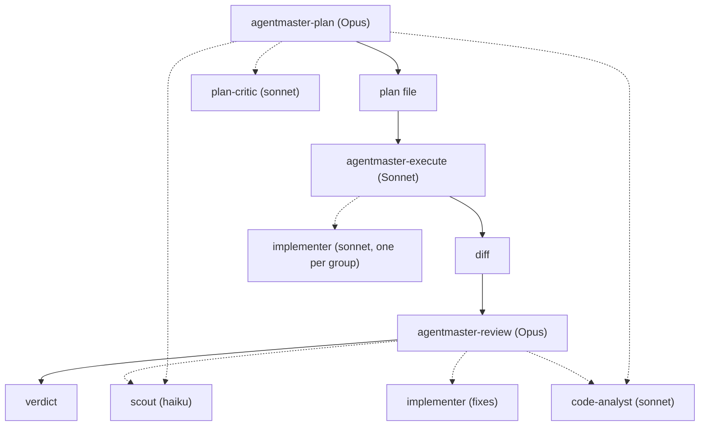

# agentmaster

[](https://github.com/rhawk117/agentmaster/actions/workflows/quality.yml) [](https://github.com/rhawk117/agentmaster/actions/workflows/release.yml) [](pyproject.toml) [](LICENSE) [](https://github.com/astral-sh/uv)

Expensive head, cheap hands. A master decision-maker on a frontier reasoning
model never touches the repository. It commands subagent workers that do
all the reading, running, and writing, with adversarial gates at both ends:
a critic that assumes the plan is wrong before anything is built, and a
reviewer that assumes the code is guilty after it is built. The design is
language-agnostic: every stage runs the project's own toolchain, detected at
plan time.

This borrows a page from how Jarred Sumner rewrote Bun's roughly
535,000-line Zig codebase in Rust in 11 days with around 64 concurrent
Claude agents (see the [Bun in Rust
post](https://bun.com/blog/bun-in-rust) and [Simon Willison's
writeup](https://simonwillison.net/2026/Jul/8/rewriting-bun-in-rust/)). That
effort kept implementers and reviewers adversarial: reviewers saw none of
the implementer's reasoning and started from the assumption that the diff
was broken, a separation `agentmaster-review` shares. It is the workflow I
use day to day with Claude Code and GitHub Copilot.

Works on Claude Code (skills + agents) and GitHub Copilot (custom agents).

## Quick start

```bash
git clone https://github.com/rhawk117/agentmaster && cd agentmaster
python install.py install                  # both platforms; add --target claude|copilot
python install.py install --dry-run        # preview every file first
python install.py uninstall --target all   # clean removal, hook entries stripped
```

Python 3.14+ is the only requirement. The installer is stdlib-only, so there
are no dependencies to install. Every role — coordinator, orchestrator,
implementer, reviewer — resolves independently: `--claude-model` /
`--copilot-model` sets the coordinator, and `--claude-orchestrator-model`,
`--claude-implementer-model`, `--claude-review-model` (each with a matching
`-effort low|medium|high|xhigh|max` flag), and `--copilot-implementer-model`
target one role. Explicit flags always win; when a flag is absent and the
session is a TTY the installer prompts per role, and a non-TTY session (or
`--no-input`) takes the recommended default silently. Copilot has no
orchestrator/reviewer roles and never gets an effort field. Every file it
would overwrite is copied first into a timestamped
`agentmaster-backup-<timestamp>/` under the config home, and the five hook
events it merges into `settings.json` are merged idempotently, never
clobbering hooks you already have. The superpowers-plugin check prints the
exact install commands when the plugin is missing.

The ledger (`~/.agentmaster/ledger.sqlite3` by default) and its artifact
store are enabled by default with structured metadata; `--ledger-path` and
`--artifact-dir` relocate them, `--no-ledger` disables both (`--no-ledger`
and `--ledger-path` together are rejected), and `--delivery-mode
local|commit|pull-request|merge` sets how a run may publish its changes.
Dry-run and a disabled ledger never create a directory, database, or
artifact.

`--auto-compact-percent 1-100` (Claude only) sets
`CLAUDE_AUTOCOMPACT_PCT_OVERRIDE`; `--clear-auto-compact-override` removes
an Agentmaster-managed override instead (the two are mutually exclusive). An
interactive install without either flag offers preserving current/default
behavior, setting 50% (recommended for long Agentmaster execution
sessions), a custom percentage, or clearing an existing override; a
noninteractive install without either flag leaves current behavior
untouched. This affects the main Claude conversation and all subagents.
Earlier compaction reduces working-context pressure but may discard detail
and disrupt cache continuity; it is not a per-implementer control. On
reinstall the original pre-Agentmaster value is preserved, and clearing or
uninstalling restores it only while Agentmaster still owns the current
value.

After a Claude Code install, restart once if `~/.claude/skills/` or
`~/.claude/agents/` were newly created. Keep `CLAUDE_CODE_SUBAGENT_MODEL`
unset: it silently overrides every worker's model pin, and the shipped
`Explore` override keeps Claude's automatic exploration on haiku. Copilot
platform specifics live in [`copilot/README.md`](copilot/README.md).

> [!TIP]
> No clone needed for a pinned version. Each GitHub Release attaches
> `agentmaster-<tag>.zip`; unzip it and run the same `install.py` commands.

## Requirements

> [!IMPORTANT]
> The superpowers plugin (obra) is required on both platforms. The plan
> phase uses `brainstorming` and `writing-plans`, and the handoff offers
> `executing-plans`. The installer detects it and prints the install
> commands for `obra/superpowers-marketplace`; without it, plan formalization
> falls back to inline structure, which works but is not the supported
> configuration.

## The pipeline

Three deliberate invocations, no freehand prompting between phases. The
orchestrator-with-parallel-subagents shape follows the pattern Anthropic
describes in [How we built our multi-agent research
system](https://www.anthropic.com/engineering/multi-agent-research-system);
keeping the orchestrator's hands off the repository entirely is
agentmaster's own rule.



1. `agentmaster-plan` (Opus) frames the goal, inventories usable skills
   and tools, detects the project toolchain, gathers evidence through
   parallel `scout` (haiku) and `code-analyst` (sonnet) dispatches into a
   cited evidence ledger, drafts a plan with conflict-free parallel groups,
   survives up to two rounds of `plan-critic` adversarial review, and
   formalizes via superpowers `writing-plans` when present.
2. `agentmaster-execute` runs the plan's declared execution mode:
   sequential by default (one `implementer` on sonnet carried across groups,
   so conventions stay coherent), parallel only when the plan justifies
   semantic independence, with an optional pilot group checked first. Gates
   every task on its verification, independently re-runs the riskiest ones,
   runs a cross-group coherence pass on the combined diff, then chains into
   the review.
3. `agentmaster-review` (Opus) assumes the code is bad and makes it prove
   otherwise across five evidence axes: correctness, bugs, and regressions
   (full-suite runs, any severity); structure quality (SOLID, YAGNI, DRY)
   and testability and flexibility-to-change (capped at major); security
   (any severity). Adjudicates every finding in writing, dispatches fix
   implementers, re-reviews once with a full-suite re-run, then surfaces
   anything still open.

Evidence discipline throughout: workers return capped structured reports
(verified / inferred / unknown, `file:line` citations, no code dumps). A
blocked scout escalates once to the analyst, then the question becomes a
recorded unknown, never an orchestrator improvisation, never a theory in
place of evidence.

## Language-agnostic by design

The planning phase's first dispatch is always a toolchain scout: it reads
manifests and CI configuration (pyproject, package.json, Cargo.toml, go.mod,
Maven/Gradle files, Makefiles, workflow definitions) and records the
project's canonical test, lint, security-scan, and build commands, with
file evidence, into the plan's Toolchain section. Execution and review run
those recorded commands. Nothing in the suite assumes Python, `uv`, or any
particular runner; the security axis uses whatever the ecosystem provides
(bandit/semgrep, eslint security rules, npm audit, gosec, cargo audit,
SpotBugs, and so on).

## Models and cost

Coordinators pin the frontier model (Opus 4.8 here; swap the `model` lines
if your org enables something else). Workers pin haiku for retrieval and
sonnet for analysis, critique, and implementation. Anthropic's [When to use
multi-agent systems (and when not
to)](https://claude.com/blog/building-multi-agent-systems-when-and-how-to-use-them)
covers when this kind of decomposition pays for itself, which is the same
question the proportionality gate asks before every plan. On Claude Code
the elevation is per-skill, so everyday sessions stay cheap; skill-level
pins are best-effort on current CLI versions, though, so the plan and
review skills state the model they are running on at phase start and
`/model` is the check. On Copilot the billing is multiplier-based, and
pinning `scout` to a 0x included model makes evidence gathering effectively
free. Worker `maxTurns` and `effort` values are the runaway-spend caps:
tune per repo size; the telemetry model column records which model each
worker actually ran on, so pin effectiveness is verifiable from data.

## Telemetry

The hook layer owns all telemetry rows: it appends
`<phase>,<agent>,<model>,<tokens>,<duration_ms>` lines to
`.agentmaster/sessions/<harness-session-id>/telemetry.md` (falling back to the
legacy root `.agentmaster/telemetry.md` for rows written before session
scoping), so two sessions in one checkout never clobber each other's
telemetry. The phase comes from the session's `.phase`
marker the coordinator skills set and clear at phase boundaries (`hook` when
none is active), the model and tokens from the payload or the subagent
transcript where the platform reports them, and the wall-clock duration from
a start/stop timestamp pair. `PreCompact` rows use the agent column to
distinguish who compacted: `precompact:main` for the primary session,
`precompact:implementer` and `precompact:<subagent>` otherwise, with the
pre-compaction token count in the tokens column when the provider supplies
it. The skills never hand-append rows. Read the
running totals per agent, phase, and model with `make telemetry
SESSION=.agentmaster/sessions/<id>` (or `uv run python
scripts/telemetry_report.py <session-dir>/telemetry.md` directly). Prune with
`make clean-telemetry SESSION=.agentmaster/sessions/<id>`: it
keeps the newest 500 lines and 5 compaction snapshots and drops `.starts`
orphans and a stale `.phase` marker older than a day (`--keep-lines`,
`--keep-snapshots`, and `--dry-run` adjust that). Nothing prunes
automatically. The hooks only ever append, so pruning is always an explicit
choice.

## Retro loop

`/agentmaster-retro` is a fourth skill alongside `agentmaster-plan`,
`agentmaster-execute`, and `agentmaster-review` (opus-pinned,
`disable-model-invocation`, so it never auto-fires) that closes a recursive
analyze-fix-verify loop over the suite's own accumulated artifacts, rather
than over a single task. Its corpus is fixed by convention: `.transcripts/`
(prose only — code files inside it are never read), root-level run artifacts
(run transcripts, generated docs), every session's
`.agentmaster/sessions/<id>/telemetry.md`, and every
prior `.agentmaster/retro/*.md`. A `scout` inventories the corpus,
`code-analyst` grades each artifact against a rubric in
`criteria/retro-criteria.md` — marking each finding
ALREADY-FIXED/PARTIALLY-FIXED/UNFIXED against current skill text — using the
same injected-between-markers pattern `criteria/review-criteria.md` uses,
kept in sync by `python install.py sync`/`validate`. It ranks the weaknesses,
dispatches `implementer` fixes verified by `scripts/plan-structure-lint.sh`
and the full quality gate, and writes a dated report to
`.agentmaster/retro/<date>-<slug>.md` so the next run picks up where the last
one left off; each subsequent pipeline run deposits new transcripts, so
re-running `agentmaster-retro` closes the loop. `evals/evals.json` carries a
seeded-flaw fixture (`evals/fixtures/flawed-retro-corpus/`) exercising the
loop end to end, schema-checked in CI by `tests/test_evals.py`.

## Claude Code hook layer

Five lifecycle hooks convert protocol into mechanism, unique to Claude Code.
The hooks are Python scripts installed to `~/.claude/agentmaster/hooks/` and
registered idempotently in `~/.claude/settings.json` (your existing hooks are
never touched): `SubagentStart`/`SubagentStop` (roster-scoped) measure every
worker dispatch into the telemetry file described above, so telemetry no
longer depends on the orchestrator remembering; a `PreToolUse` guard on the
`Agent`/`Task` tools blocks all dispatch while `CLAUDE_CODE_SUBAGENT_MODEL`
is exported, since that variable silently defeats the tiering; `PreCompact`
snapshots `.agentmaster/` into a fresh, uniquely named directory under
`.agentmaster/compaction-snapshots/` before every compaction, so same-second
or overlapping compactions never merge or overwrite each other's history;
and `SessionStart` injects a re-hydration pointer whenever a
project carries agentmaster artifacts. The coordinator skills additionally
carry a frontmatter `PreToolUse` cost-boundary hook, armed only while
`.agentmaster/.phase` names a phase. All scripts parse hook JSON
permissively across CLI versions.

> [!NOTE]
> Set `AGENTMASTER_HOOK_DEBUG=1` to dump raw hook payloads to
> `.agentmaster/hook-debug.jsonl` for one-run verification.

## Development

One command verifies the repository, and CI runs exactly it:

```bash
make check                          # ruff format+check, bashate, ty, compileall+pytest, parity validation, bandit
bash scripts/code-quality.sh all    # identical; use where make is absent
```

`make help` lists every target, itself included; the rest are `check`,
`lint`, `shell`, `typecheck`,
`test`, `format`, `validate`, `security`, `sync`, `install`, `install-claude`,
`install-copilot`, `uninstall`, `telemetry`, and `clean-telemetry`.

Worker agent prompts are generated: edit `shared/agents/<name>.md` and run
`make sync` (equivalently `python install.py sync`). `make validate` fails on
any undeclared drift between the shared sources and the committed
Claude/Copilot copies, and the same command re-syncs the review-criteria block
from `criteria/review-criteria.md`. Requires Python 3.14+ and
[uv](https://docs.astral.sh/uv/).

## Releasing

Bump `version` in `pyproject.toml` and commit it, then tag and push:

```bash
git tag v<version> && git push origin v<version>
```

The `release.yml` workflow re-runs the full quality gate, rejects any tag
whose `v<version>` does not equal the `pyproject.toml` version, builds the
runtime bundle `agentmaster-<tag>.zip` from the single source of truth in
`scripts/release_bundle.py` (`install.py`, `installer/`, `agentmaster/`,
`ledger/`, `shared/`, `agents/`, `copilot/`, `skills/`, `hooks/`,
`criteria/`, `scripts/telemetry_report.py`, `README.md`, `LICENSE`,
`pyproject.toml`; no tests, `.github/`, or local ledger/session state, since
`git archive` only ever includes tracked files), generates a `SHA256SUMS`
file, extracts the archive and smoke-tests `install.py --help`,
`agentmaster ledger doctor --help`, and a temporary `agentmaster ledger init`
against it under Python 3.14, then attaches the zip and checksums to a
GitHub Release and auto-generates the notes. A failed gate means no
release was ever published: delete the tag, fix the failure, and re-tag.
Once a release **has** been published, its tag is immutable — a bad release
gets a new patch version, never a retagged `v<version>`.

## Hardening: how each former weakness is now addressed

> [!WARNING]
> Every item below still carries a residual limitation, called out inline
> as "Residual:". Read those before assuming a weakness is fully closed.

1. Prose-only cost boundary (Claude Code) → default-on `PreToolUse` hooks in
   all four skills run `cost_boundary.py`, which blocks
   Read/Grep/Glob/Bash/Web/Edit/Write in the main thread with a delegation
   reminder (execute keeps Read for the plan file). The hook is armed only
   while `.agentmaster/.phase` names a phase — the skills set the marker at
   phase start and clear it at phase end, so the boundary cannot outlive
   its phase — and paths outside the workspace (the plan-mode plan file,
   the session scratchpad) and under `.agentmaster/` stay writable.
   Residual: Claude Code prompts once to approve skills that define hooks.
2. Elevation-lifetime ambiguity → every phase ends with an explicit phase
   boundary: it reminds you the session may still be elevated (`/model` to
   check, fresh session to drop) and refuses to roll into the next phase in
   the same turn. Each next phase re-pins its own model on invocation.
3. Ledger volatility → ledgers are persisted artifacts: a scout writes
   `.agentmaster/ledger.md` after every dispatch batch and
   `.agentmaster/review-ledger.md` after adjudication; compacted context
   re-hydrates from the file of record.
4. Lossy report caps → workers save complete raw evidence to
   `.agentmaster/evidence/<question-slug>.md` and cite the path, so capped
   reports lose nothing recoverable; orchestrators refuse to read past the
   contract sections of an over-cap report and re-dispatch narrower.
5. File ownership ≠ resource ownership → the toolchain scout also inventories
   shared mutable resources; the plan carries a Shared resources section
   (owner group or SERIALIZE per resource), tasks touching serialized
   resources are tagged `verification: serialized` and run in sequence by
   the execution coordinator, and the plan-critic treats omissions in that
   section as findings.
6. Self-reported verification → execution independently re-runs at least the
   highest-risk verification of every group via scout before the gate;
   serialized verifications are always scout-run, never implementer-claimed.
7. Criteria triplication → single source of truth: `criteria/review-criteria.md`
   injected between markers into all three carriers by `python install.py sync`.
   Edit the master, run the command; the copies are generated, not maintained.
8. `/fleet` foot-gun → the plan document opens with an execution contract
   instructing any fleet/autopilot/generic agent that reads it to stop and
   hand back to `agentmaster-execute`. The artifact defends itself even
   when the menu is mis-clicked. Residual: a worker that ignores its input
   entirely isn't stopped by anything but the docs.
9. No cost telemetry → the hook layer records every worker dispatch to
   `.agentmaster/telemetry.md` automatically, stamped with the active phase
   and the worker's model; every phase still closes with a human-readable
   cost appendix, but no phase hand-appends rows. Tuning `maxTurns` and
   model pins is done from that file, not by feel. Residual: Copilot
   reports per-request multipliers via `/usage`, not per-subagent tokens.
10. No evals → `evals/evals.json` ships eight cross-stack cases (JS/TS plan,
    headless Go plan, execution chain, seeded-flaw review, trigger-gating,
    proportionality triage, a seeded-flaw retro run, and the plan-structure
    lint) with objective assertions, schema-validated in CI by
    `tests/test_evals.py` — the first automated consumer of `evals/`.
    Residual: schema-checked, not yet executed at scale; run them.
11. Interactive-only seams → headless mode in every phase: `--headless` (or a
    non-interactive session) replaces questions with ASSUMED
    least-destructive defaults recorded in Open Questions, or a machine-
    readable `BLOCKED:` report when no safe default exists. CI entry:
    `claude -p "/agentmaster-plan --headless <task>"`.

## Research-driven revisions

The v2 pass applies the multi-agent literature's strongest critiques of the
original design: write work parallelizes poorly, so sequential execution
with one carried implementer is now the default and `parallel` must be
argued; a coherence pass over the combined diff closes the merge-divergence
gap parallel mode leaves; a proportionality gate (and `--lite`) keeps the
15x-class token ceremony away from tasks that don't decompose, including
recommending no pipeline at all for trivial changes; serialized
verifications batch into one dispatch; telemetry follows a fixed
`phase,agent,model,tokens,duration_ms` schema summarized by
`scripts/telemetry_report.py`; and `python install.py validate`
fails CI on criteria or generated-file drift.

### Further reading

- Anthropic, [How we built our multi-agent research
  system](https://www.anthropic.com/engineering/multi-agent-research-system)
- Anthropic, [When to use multi-agent systems (and when not
  to)](https://claude.com/blog/building-multi-agent-systems-when-and-how-to-use-them)
- Jarred Sumner, [Bun in Rust](https://bun.com/blog/bun-in-rust)
- Simon Willison, [rewriting Bun in
  Rust](https://simonwillison.net/2026/Jul/8/rewriting-bun-in-rust/)
